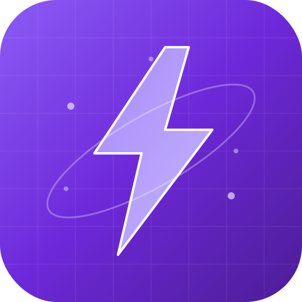

# RAG Studio Pro

> **Understand. Build. Visualize. Optimize.**

The world's most interactive platform to learn, build, and master Retrieval-Augmented Generation.



---

## 🚀 Quick Start

### Prerequisites

- **Node.js** 18+ and npm
- **Python** 3.10+ (for backend)
- **Ollama** (optional, for local LLM inference)

### Installation

```bash
# Clone the repository
git clone https://github.com/your-username/rag-studio-pro.git
cd rag-studio-pro

# Install frontend dependencies
npm install

# Install Python backend dependencies
pip install -r requirements.txt
```

### Running

```bash
# Start the frontend (Vite dev server)
npm run dev

# In a separate terminal, start the backend
cd backend
python start.py
```

The app will open at `http://localhost:5170`

---

## 🏗️ Architecture

```
rag-studio-pro/
├── electron/           # Electron main process
│   ├── main.js         # Main process
│   └── preload.js      # IPC bridge
├── src/                # React frontend
│   ├── components/     # Shared components
│   ├── pages/          # Page components
│   ├── lib/            # Utilities
│   └── main.tsx        # Entry point
├── backend/            # FastAPI Python backend
│   ├── main.py         # API server
│   └── start.py        # Startup script
├── public/             # Static assets
├── package.json        # Frontend config
├── requirements.txt    # Python dependencies
└── electron-builder.yml # Build config
```

---

## 📦 Building for Production

### Windows Desktop App (.exe)

```bash
# Build the frontend
npm run build

# Build Electron app for Windows
npm run electron:build:win
```

Output will be in `dist-electron/`.

### Web Deployment (Vercel)

```bash
# Build for web (no Electron)
npm run build

# Deploy to Vercel
npx vercel --prod
```

---

## 🎯 Features

### Learning Center
- **Chunking Simulator** - Adjust chunk size and overlap in real-time
- **Embedding Visualizer** - See how text becomes vectors
- **Cosine Similarity** - Interactive similarity calculations
- **RAG vs Fine-Tuning** - Side-by-side comparison

### Playground
- **Prompt Engineering** - Experiment with different prompts
- **Token Counter** - Visualize tokenization
- **Context Window** - See how context limits work
- **RAG Pipeline Sim** - Simulate end-to-end pipelines

### RAG Builder
- **Document Upload** - PDF, TXT, CSV, Markdown, HTML
- **Chunking Config** - Multiple strategies
- **Embedding Models** - MiniLM, BGE, MPNet, E5
- **Vector Databases** - FAISS, ChromaDB, Qdrant
- **LLM Integration** - Ollama, OpenAI, Anthropic, Google

### Analytics
- **Performance Metrics** - Precision, Recall, F1, MRR
- **Latency Tracking** - Embedding, retrieval, generation times
- **System Resources** - CPU, Memory, GPU monitoring

### Model Manager
- **LLM Models** - Download and manage local models
- **Embedding Models** - Switch between embedding models
- **Datasets** - Organize and manage document collections
- **Benchmarks** - Compare model performance

---

## 🛠️ Tech Stack

| Layer | Technology |
|-------|-----------|
| Desktop | Electron 33 |
| Frontend | React 18, Vite, Tailwind CSS |
| State | Zustand |
| Animation | Framer Motion |
| Charts | Recharts, Plotly |
| Backend | FastAPI, Python |
| ML | sentence-transformers, FAISS, ChromaDB |
| LLM | Ollama (local), OpenAI, Anthropic |

---

## 📄 License

MIT License

---

## 🚀 Deployment Guide

### Web Deployment (Vercel)

1. Push your code to GitHub
2. Connect your repository to [Vercel](https://vercel.com)
3. Vercel will auto-detect the Vite framework
4. Deploy with one click

### Windows Desktop App (.exe)

1. Install dependencies: `npm install`
2. Build for Windows: `npm run electron:build:win`
3. Find the installer in `dist-electron/`
4. Distribute `RAGStudioPro-Setup-*.exe` or `RAGStudioPro-*-Portable.exe`

### Local Development

```bash
# Install dependencies
npm install

# Start development server
npm run dev

# In another terminal, start Python backend
cd backend
pip install -r requirements.txt
python start.py
```

### Python Backend Setup

```bash
# Create virtual environment
python -m venv venv
source venv/bin/activate  # On Windows: venv\Scripts\activate

# Install dependencies
pip install -r requirements.txt

# Start the backend
cd backend
python start.py
```

### Ollama Setup (Optional)

1. Install Ollama: https://ollama.ai
2. Pull a model: `ollama pull llama3.2`
3. The app will automatically connect to Ollama
